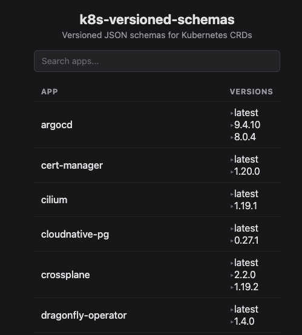

# k8s-versioned-schemas

## *Versioned* YAML JSON-schemas for CRDs in Kubernetes.



Visit this page at https://versioned-k8s-schemas.pages.dev

## Quickstart

The url format for the schemas is `versioned-k8s-schemas.pages.dev/{APP}/{VERSION}/{CRDKIND_VERSION}`. For consistency, none of the versions are v-prefixed even if the upstream is. For example, to get schemas for Cloudnative-PG's `backup` CRD:

- From whatever the latest version of Cloudnative-PG is: `https://k8s-versioned-schemas.pages.dev/cloudnative-pg/latest/backup_v1.json`
  - `# yaml-language-server: $schema=https://k8s-versioned-schemas.pages.dev/cloudnative-pg/latest/backup_v1.json`
- From Cloudnative-PG 0.27.1: `https://k8s-versioned-schemas.pages.dev/cloudnative-pg/0.27.1/backup_v1.json`
  - `# yaml-language-server: $schema=https://k8s-versioned-schemas.pages.dev/cloudnative-pg/0.27.1/backup_v1.json`

For convenience, since the app names are somewhat arbitrary and it's not reasonable to have to guess or look back through the repo, there's a simple ui at the root: https://versioned-k8s-schemas.pages.dev. The page lists all apps, versions, and links to the respective schemas, along with a search bar for app names. The page is updated alongside the schemas. *NOTE*: The `copy` button in the ui copies the whole `# yaml-language-server: $schema={schemaurl}` line for convenience.

## Why?

CRDs change as the software distributing them evolves. Currently, using [redhat's yaml-language-server](https://github.com/redhat-developer/yaml-language-server),
there seem to be 2 common ways to add schemas for k8s custom resources.

A) Use a public repository of schemas, like [datreeio/CRDs-catalog](https://github.com/datreeio/CRDs-catalog).

| Pros | Cons |
|------|------|
| No setup required | Schemas are only valid at the time they were extracted, requires manual updates |
| Large, crowdsourced collection of CRDs | No history for old CRDs |

B) Extract schemas from a running cluster and publish to an accessible URL.

| Pros | Cons |
|------|------|
| Schemas match your exact cluster state and app versions | Requires a running cluster or previously extracted CRDs |
| Includes all installed CRDs | *ONLY* includes installed CRDs |
| | Complexity to extract/publish schemas safely |

In my opinion, neither approach is ideal:
- **Option A** requires manually contributing new schema versions and waiting for review/merge before they're published
- **Option B** requires installing CRDs on a cluster before you can even configure the app (with the schemas)

My alternative option here:

C) Generate versioned schemas directly from upstream sources.

| Pros | Cons |
|------|------|
| Schemas are versioned per-app and the latest version is guaranteed to exist | Requires CRD raw yaml |
| No running cluster needed | Sorted by somewhat-arbitrary App names instead of CRD Groups |
| Pulls directly from upstream Helm charts and CRD files | Complex workflow to extract and publish |
| Automatically tracks new versions via Renovate and publishes them | |

## How?

Each "app" to publish CRDs for has a metadata yaml file in `apps/`. The file includes the version of the app, Renovate configuration to track the version, and sources to extract the CRDs from. The logic for parsing these files is in [gen-schemas.sh](https://github.com/aclerici38/k8s-versioned-schemas/blob/main/gen-schemas.sh), which uses the amazing [openapi2jsonschema.py](https://github.com/yannh/kubeconform/blob/master/scripts/openapi2jsonschema.py) script to save json schemas for each CRD into `schemas/`. `schemas/` then gets served via cloudflare pages at https://versioned-k8s-schemas.pages.dev. A git tag `app/version` is created for each update along with a release showing the diff from the previous CRDs.

### Adding a new app

The app metadata files attempt to support all methods of distrubuting CRDs with an emphasis on ease-of-addition to this repo. Method of adding the CRDs is up to the author. Personally, I prefer adding via the chart if possible since the urls are easy to find. See the full example at https://github.com/aclerici38/k8s-versioned-schemas/blob/main/full-example-app.yaml to see all the configuration options. Make a pull request with the app (1 app per pull request please) and I will get to it ASAP.

## Usage

To track the versions in the `yaml-language-server` lines with Renovate, I use this custom manager. Note, the tags released are in the format `app/version` with a literal forward slash in the tag:
```
{
  $schema: "https://docs.renovatebot.com/renovate-schema.json",
  customManagers: [
    {
      customType: "regex",
      fileMatch: [".yaml"],
      matchStrings: [
        "k8s-versioned-schemas\\.pages\\.dev/(?<depName>[^/]+)/(?<currentValue>[^/]+)/"
      ],
      datasourceTemplate: "github-tags",
      packageNameTemplate: "aclerici38/k8s-versioned-schemas",
      extractVersionTemplate: "^{{{depName}}}/(?<version>.*)$"
    },
  ],
}
```

I have thought of a couple ways to utilize the versioned schemas, where they're providing benefits over the existing options. Be sure to note the downsides of each option as well. If you have a better method let me know!

- Always use `/latest` version in url. This is guaranteed to point at the latest CRD schemas for an app (since Renovate will update them) but the url will never change, meaning the yaml-language-server's cache will have to expire or be purged before new versions are fetched. (e.g. # yaml-language-server: $schema=https://k8s-versioned-schemas.pages.dev/cloudnative-pg/latest/backup_v1.json)

- Pin schemas to app version, add a Renovate group with [`minimumGroupSize`](https://docs.renovatebot.com/configuration-options/#minimumgroupsize). This ensures an update for the app AND schemas is available so they remain on the same version. In addition, any diff in the schemas is added to the release notes here which will be shown in a pull request from Renovate. In practice, maintaining a group for each app/CRD combo can be cumbersome and updates can be suppressed if there's an issue here, or with renovate, or with the upstream. These errors can compound as the schema likely uses a different datasource for versioning that the app.

- Pin schemas to app version but automerge them. This avoids yaml-language-server caching and adding Renovate groups, but assumes you will ALWAYS be running the latest version of apps. In practice there are likely not enough CRD changes to make a big difference (assuming apps are reasonably up to date :smile:). I like to keep things up to date, so this is what I'm currently doing in [my home-ops repo](https://github.com/aclerici38/home-ops).

- Manually bump the versions in the url. No fun.

## Acknowledgements
- [Kubeconform](https://github.com/yannh/kubeconform) for the openapi2jsonschema script this relies on
- [Renovate](https://github.com/renovatebot/renovate) for easy and endlessly-configurable version tracking
